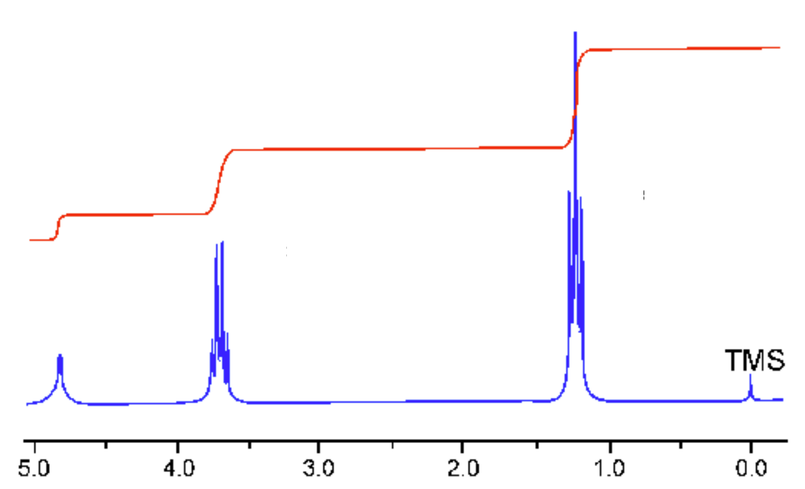
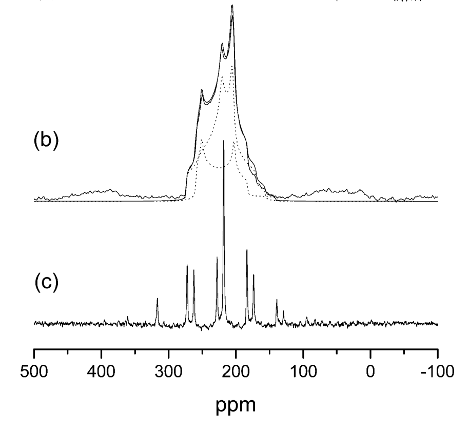

# 4 NMR shielding and EFG 

## Part 1

We start running castep calculations by looking at two small systems, and examining the issue of "convergence".

Start by copying the input files into your home directory i.e.

 ```
 cp  /home/jryates/WORKSHOP/workshop_nmr_intro.tgz ./
 ```
 unpack it
 
 ```
 tar -zxvf workshop_nmr_intro.tgz
 ```

###Example 1 - Ethanol CH<sub>3</sub>CH<sub>2</sub>OH
{width ="300"}
<figure fig1>
  <figcaption>Fig1. Proton spectrum of ethanol</figcaption>
</figure>


The discovery that one could actually see chemical shifts in hydrogen spectra was made in 1951 at Stanford University by Packard, Arnold, Dharmatti (shown in Fig 1). We will try to reproduce this result.

FILES:   

* ethanol.cell

```
%BLOCK LATTICE_ABC
6 6 6
90 90 90
%ENDBLOCK LATTICE_ABC

%BLOCK POSITIONS_ABS
H 3.980599 4.178342 3.295079
H 5.033394 3.43043 4.504759
H 5.71907 4.552257 3.315353
H 3.720235 5.329505 5.509909
H 4.412171 6.433572 4.317001
H 5.911611 5.032284 6.242202
C 4.84694 4.350631 3.941136
C 4.603025 5.518738 4.882532
O 5.746254 5.812705 5.6871
%ENDBLOCK POSITIONS_ABS

%BLOCK KPOINTS_LIST
0.25 0.25 0.25 1.0
%ENDBLOCK KPOINTS_LIST
```

* ethanol.param
```
xcfunctional = PBE
fix_occupancy = true
opt_strate.g.y : speed
task        = magres

cut_off_energy  = 20 ry
```


OBJECTIVES:

* Examine the convergence of the chemical shieldings with planewave cutoff
* Compare to experiment.

INSTRUCTIONS:

* Look at the cell and param file. Note that the only special keyword is `task = magres`

* Run castep. `castepsub -n 4  ethanol` Look at the output file. At the end the isotropic chemical shielding, anisotropy, and asymmetry are reported (here we are only interested in the isotropic value.)

* This information, plus the full tensors is also given in the file ethanol.magres

* You might wish to transfer the *.magres file back to your desktop to visualise with [MagresView](https://www.ccpnc.ac.uk/magresview/magresview/magres_view.html?JS).

* Examine the effect of increasing the cutoff energy (say 20-50 Ryd in steps of 10 Ryd). It always helps to plot a graph of the convergence (e.g. with gnuplot or xmgrace on the cluster - or with excel on the pc)

* Find the "converged" hydrogen (or proton in NMR language) shieldings. We will compare them to experiment. The three methyl (CH<sub>3</sub>) protons undergo fast exchange; they "rotate" faster than the nuclear magnetic moment processes. The magnetic moment will therefore "see" an average chemical shielding. The same is true of the CH<sub>2</sub> protons.

* Average the CH<sub>3</sub> and CH<sub>2</sub> chemical shieldings. This will give you 3 unique chemical shieldings.

* We now need to convert the chemical shieldings &#963;<sub>iso</sub> to chemical shifts &#948;<sub>iso</sub> on the experimental scale. We use the relation: &#948;<sub>iso</sub>=&#963;<sub>ref</sub>-&#963;

A suitable &#963;<sub>ref</sub> for 1H is 30.97ppm.


{width ="300"}
<figure fig1>
  <figcaption>Fig2. 1H NMR spectrum of liquid ethanol</figcaption>
</figure>


* Fig. 2 shows a modern high-resolution 1H spectrum for liquid ethanol. Note that the peaks are split due to J-coupling - the interaction of the 1H magnetic moments - but let's ignore that for now. The three peaks are roughly at 1.2ppm, 3.7ppm and 5ppm. You should find that your computed values agree for two sites. Do you know why the other site has such a large disagreement with experiment?


###Example 2 - Diamond

FILES:

* diamond.cell

```
%block LATTICE_CART
0 1.7 1.7
1.7  0 1.7
1.7 1.7 0
%endblock LATTICE_CART

%block POSITIONS_FRAC
C   0.000000   0.000000   0.000000
C   0.250000   0.250000   0.250000
%endblock POSITIONS_FRAC


kpoints_mp_grid  4 4 4

symmetry_generate
```
* diamond.param

```
comment         = nmr testing
iprint          = 1
xcfunctional = LDA
task : magres
fix_occupancy = true
opt_strategy : speed
cut_off_energy  =  30 Ry
```

OBJECTIVES:

Examine the convergence of the chemical shielding as the sampling of the electronic Brillouin zone (BZ) is increased.

INSTRUCTIONS:

* Look at the files diamond.cell and diamond.param
* We have specified the kpoints in the cell file using the keyword
`kpoints_mp_grid 4 4 4`
* Run CASTEP for a range of kpoint meshes (say 2,4,6,8,10)
* Examine (plot?) the convergence of the chemical shielding.

The computational cost scales linearly with the number of kpoints (i.e. the number of points in the irreducible Brillouin Zone). For a large unit cell (i.e. a small BZ) it may be possible to get converged results using a single k-point. But which kpoint should we choose?
For diamond we will look at 3 different k-points (0,0,0), (½,½,½) (¼,¼,¼). Specify the kpoint in the cell file using
```
%BLOCK KPOINTS_LIST
0.25 0.25 0.25 1.0
%ENDBLOCK KPOINTS_LIST
```
Which gives a result closest to the converged answer?
(as the diamond unit cell is rather small the 1 kpoint answer is not too close to converged. However, the observation holds true for all orthorhombic cells)

##Part 2

We now look at some more realistic examples.

**Oxygen-17**

Oxygen is a component of many geological materials. Oxygen is
also important element in organic and biological molecules since it is often intimately involved in hydrogen bonding. Solid State ^17^O NMR should be a uniquely valuable probe as the chemical shift range of ^17^O covers almost 1000 ppm in organic molecules. Furthermore ^17^O has spin I = 5/2 and hence a net quadrupole moment. As a consequence of this the solid state NMR spectrum is strongly affected by the electric
field gradient at the nucleus.

Because the isotopic abundance of ^17^O is very low (0.037%) and the NMR linewidths due to the electric field gradient relatively large, only limited Solid State NMR data is
available. This is particularly true for organic materials. First principles calculations of ^17^O NMR parameters have played a vital role in assigning experimental spectra, and developing empirical rules between NMR  parameters and local atomic structure.


###Example 3 - Alanine, a simple amino acid

FILES:

* alanine.cell
* alanine.param
* alanine.pdb

OBJECTIVES:

* Compute the chemical shift and Electric field gradient for alanine
* Assign the ^17^ NMR spectrum

{width ="300"}
<figure fig3>
  <figcaption>Fig3. Solid-State O17 NMR spectrum of L-alanine. (b) is from MAS (magicangle- spinning) (c) is from DOR (double-orientation rotation)</figcaption>
</figure>


INSTRUCTIONS:

* Look at the cell and param files. The geometry for alanine was obtained by neutron diffraction and was downloaded from the Cambridge Crystallographic database. View the original pdb file note the hydrogen bonding

* Run the example - the calculation is not fully converged. However, the relative shift between the two sites is fairly converged.

* The experimental ^17^O NMR spectrum shows two peaks (Fig 3 (b)) - they are very broad due to the quadrupolar coupling, and overlap. The experimental parameters are given in Table 1.

* Assign the two resonances A and B. Do all three computed parameters support this assignment?

| Table 1: Experimental ^17^O NMR parameters for alanine. The two resonances are labeled A and B. Isotropic chemical shift &#948;, quadrupolar coupling C<sub>Q</sub>, and EFG asymmetry &#951;<sub>Q</sub>.||
|--|--|
|&#948;(A)-&#948; (B) (ppm)| 23.5|
|C<sub>Q</sub> (A) (MHz)| 7.86|
|&#951;<sub>Q</sub> (A)| 0.28|
|C<sub>Q</sub>(A) (MHz)| 6.53|
|&#951;<sub>Q</sub>(A)| 0.70|


###Example 4 - Silicates Quartz and Cristoballite

FILES:

* quartz.cell
* quartz.param
* crist.cell
* crist.param


OBJECTIVES:

* Compute the chemical shift and Electric field gradient for two silicates.
* Assign the ^17^O NMR spectrum

INSTRUCTIONS:

* The ^17^O parameters for two silicates are reported in Table 2. From the values you compute can you tell which one is quartz? (a suitable &#963;<sub>ref</sub> is 263ppm)


**Table 2**: Experimental ^17^O NMR parameters for two silicates. Isotropic chemical shift &#948; , quadrupolar coupling C<sub>Q</sub>, and EFG asymmetry &#951;<sub>Q</sub>.

| | &#948; (ppm) | C<sub>Q</sub> (MHz) | &#951;<sub>Q</sub> |
|---|---|---|---|
|Material A| 37.2 | 5.21 | 0.13 |
|Material B| 40.8 | 5.19 | 0.19 |
