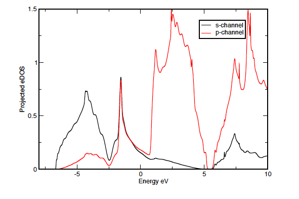

## Projected Density of States

We assume the reader is familiar with the previous section on Density of States calculations and is now familiar with running `optados`.
 
### Outline
This is a simple example of using optados for calculating electronic density of states of 2 atoms of crystalline silicon projected onto LCAO basis states.

### Input Files
* `examples/Si2_PDOS/Si2.cell` - The castep `.cell` file containing information about the simulation cell.
* `examples/Si2_PDOS/Si2.param` - The castep `.param` file containing information about the parameters for the SCF and spectral calculations.
* `examples/Si2_PDOS/Si2.odi` - The optados input file, containing the parameters necessary to run optados.

### Instructions:

* Examine the optados input file noting `TASK : pdos`. We choose to decompose the DOS into angular momentum channels `PDOS : angular` and as in the previous example we choose to recalculate the Fermi level using the calculated DOS, rather than use the Fermi level suggested by castep. 

* Execute optados.

* The output can be found in `Si2.pdos.dat`.

	```
	################################################################
	#
	#                  O p t a D O S   o u t p u t   f i l e
	#
	#  Generated on 13 Feb 2012 at 10:15:10
	################################################################
	#+-------------------------------------------------------------+
	#|                    Partial Density of States -- Projectors  |
	#+-------------------------------------------------------------+
	#| Projector:    1 contains:                                   |
	#|           Atom            AngM Channel                      |
	#|          Si   1                 s                           |
	#|          Si   2                 s                           |
	#+-------------------------------------------------------------+
	#| Projector:    2 contains:                                   |
	#|           Atom            AngM Channel                      |
	#|          Si   1                 p                           |
	#|          Si   2                 p                           |
	#+-------------------------------------------------------------+
	#| Projector:    3 contains:                                   |
	#|           Atom            AngM Channel                      |
	#|          Si   1                 d                           |
	#|          Si   2                 d                           |
	#+-------------------------------------------------------------+
	#| Projector:    4 contains:                                   |
	#|           Atom            AngM Channel                      |
	#|          Si   1                 f                           |
	#|          Si   2                 f                           |
	#+-------------------------------------------------------------+
	```
	The header shows that there are four projectors described below. The first containing the s-channels of both silicon atoms, the second the p-channels etc.

* The output is easily plotted using `xmgrace`.

* Setting `DOS_SPACING : 0.001` gives a high quality plot, as shown in the figure below.

	|  |
	|:--:|
	| <b>Density of States of Silicon generated by adaptive broadening projected onto LCAO momentum states</b>|

* Other projections to try are:
	* `PDOS : Si1;Si2(s)`  -- Output the PDOS on Si atom 1 and the PDOS on the s-channel of Si atom 2. (Resulting in two projectors)
	* `PDOS : sum:Si1-2(s)`  --  Output the sum of the s-channels on the two Si atoms. (Resulting in one projector)
	* `PDOS : Si1(p)` -- Output the p-channel on Si atom 1. (Resulting in one projector)


